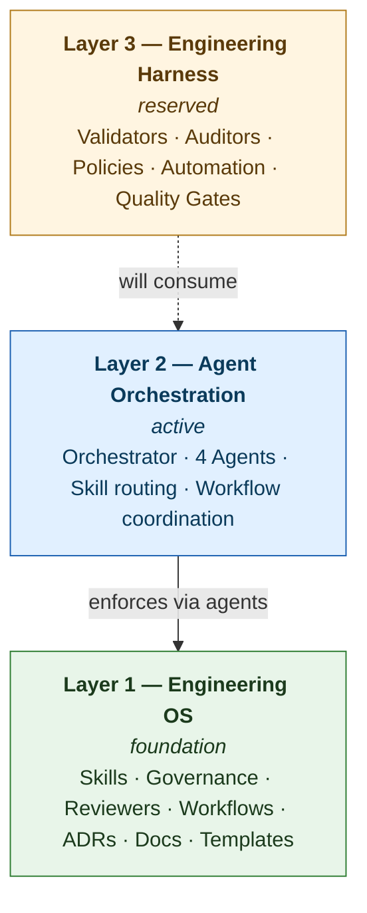

# Astro Engineering OS

[](./LICENSE)
[](./docs/architecture.md)
[](./package.json)
[](https://astro.build)

A production-grade **engineering operating system** for Astro projects and AI coding agents. Not a project template — a complete OS for building, governing, reviewing, and orchestrating Astro applications at scale.

## Overview

Astro Engineering OS provides a comprehensive framework for building, scaling, and maintaining Astro applications with enterprise-grade governance, automated review systems, AI-native workflows, and a multi-agent orchestration layer.

It helps:

- **Humans** make better engineering decisions
- **AI coding agents** produce higher-quality solutions
- **Teams** establish consistent Astro architecture patterns

## Architecture: Three Layers



### Layer 1 — Engineering OS (foundation)

Production standards, governance, and review systems.

- **Skills** — framework knowledge (astro-core + 4 domain packs + 8 specializations)
- **Governance** — 7 normative documents (architecture, components, files, dependencies, design-system, features, naming)
- **Reviewers** — 6 reviewer specs (architecture, security, performance, accessibility, SEO, code)
- **Workflows** — 5 process workflows (feature-development, architecture-review, migration, release, refactoring)
- **ADRs** — 7 architecture decision records
- **GitHub standards** — PR template, 3 issue templates, 2 CI workflows
- **Templates** — ADR, RFC, spec, refactor templates

### Layer 2 — Agent Orchestration (focus of v1.x)

AI agent coordination, skill routing, and workflow coordination.

- **Orchestrator** — `orchestrator/astro-orchestrator.md` analyzes requests, identifies project type, selects skill packs and agents, coordinates workflows, aggregates outputs
- **Agents** — 4 specialized agents
  - `architect` — architecture, rendering strategy, folder structure, data strategy
  - `implementer` — implementation, refactoring, code generation
  - `reviewer` — architecture review, performance review, security review
  - `documentation` — README, ADRs, architecture documentation, migration guides
- **Skill routing** — orchestrator selects core + domain + specialization packs per project type
- **Workflow coordination** — sequential, parallel, and coordinated execution patterns

The orchestrator **must never** implement, review, or generate architecture directly. Delegation is mandatory.

### Layer 3 — Engineering Harness (reserved)

Validators, auditors, policies, automation, and quality gates. **Reserved for a future release** by design — focus is establishing a strong foundation first. The five reserved directories are:

- `validators/` — automated policy and standard enforcement
- `auditors/` — continuous compliance and drift detection
- `policies/` — declarative rule specifications
- `automation/` — scaffolders, generators, transformers
- `quality-gates/` — merge-blocking enforcement points

See each directory's README for activation and promotion criteria.

## Core Modules

### Skills

| Skill | Purpose |
|-------|---------|
| [astro-core](/skills/astro-core/SKILL.md) | Core Astro patterns (rendering, content, data, performance, Cloudflare) |
| [astro-core/packs/blog](/skills/astro-core/packs/blog/SKILL.md) | Blog and content site patterns |
| [astro-core/packs/docs](/skills/astro-core/packs/docs/SKILL.md) | Documentation site patterns |
| [astro-core/packs/saas](/skills/astro-core/packs/saas/SKILL.md) | SaaS application patterns |
| [astro-core/packs/ecommerce](/skills/astro-core/packs/ecommerce/SKILL.md) | E-commerce patterns |
| [astro-blog](/skills/astro-blog/SKILL.md) | Blog specialization skill |
| [astro-docs](/skills/astro-docs/SKILL.md) | Documentation specialization skill |
| [astro-saas](/skills/astro-saas/SKILL.md) | SaaS specialization skill |
| [astro-ecommerce](/skills/astro-ecommerce/SKILL.md) | E-commerce specialization skill |
| [astro-performance](/skills/astro-performance/SKILL.md) | Performance optimization |
| [astro-security](/skills/astro-security/SKILL.md) | Security hardening |
| [astro-seo](/skills/astro-seo/SKILL.md) | SEO optimization |
| [astro-cloudflare](/skills/astro-cloudflare/SKILL.md) | Cloudflare deployment |

### Governance

- [Architecture](/governance/architecture.md) — feature-first architecture, component hierarchy, size limits
- [Components](/governance/components.md) — component design rules, props, slots, state
- [Files](/governance/files.md) — file/dir naming and layout, max-lines, barrel files
- [Dependencies](/governance/dependencies.md) — pinning, auditing, bundle budgets
- [Design System](/governance/design-system.md) — tokens, primitives, patterns, a11y, theming
- [Features](/governance/features.md) — feature boundaries, public surface, ownership
- [Naming](/governance/naming.md) — identifiers, files, CSS, URLs, branches, commits

### Review System

| Reviewer | Scope |
|----------|-------|
| [Architecture](/reviewers/architecture-reviewer.md) | Layout, rendering, boundaries, types, deps |
| [Security](/reviewers/security-reviewer.md) | Threat model, headers, cookies, CSRF, secrets |
| [Performance](/reviewers/performance-reviewer.md) | Core Web Vitals, hydration, asset budgets |
| [Accessibility](/reviewers/accessibility-reviewer.md) | WCAG 2.2 AA, keyboard, ARIA, contrast, motion |
| [SEO](/reviewers/seo-reviewer.md) | Metadata, JSON-LD, sitemap, hreflang |
| [Code](/reviewers/code-reviewer.md) | Readability, tests, error handling, conventions |

Each reviewer uses 0–5 scoring across 4 categories. Any category below 3 → reject.

### Workflows

- [Feature Development](/workflows/feature-development.md) — discovery → design → implement → review → release
- [Architecture Review](/workflows/architecture-review.md) — RFC → ADR → slices → verify → retrospective
- [Migration](/workflows/migration.md) — assess → plan → prototype → implement → dual-run → cutover → cleanup
- [Release](/workflows/release.md) — pre-release → tag → deploy → smoke → communicate → post-release
- [Refactoring](/workflows/refactoring.md) — motivate → scope → plan → tests → implement → verify → review

### Architecture Decisions

See [ADR](/adr/) for all architecture decisions.

### Orchestrator and Agents

- [Orchestrator](/orchestrator/astro-orchestrator.md) — central coordination layer (delegation only)
- [Architect agent](/agents/architect.md) — architecture design
- [Implementer agent](/agents/implementer.md) — code implementation
- [Reviewer agent](/agents/reviewer.md) — multi-dimensional review
- [Documentation agent](/agents/documentation.md) — README, ADR, migration guides

## Quick Start

```bash
# Run the bootstrap generator (regenerates the entire OS)
node --experimental-strip-types scripts/generate-repository.ts

# Run a specific layer
node --experimental-strip-types scripts/generate-repository.ts --only skills
node --experimental-strip-types scripts/generate-repository.ts --only orchestrator
node --experimental-strip-types scripts/generate-repository.ts --only agents

# Or via npm
pnpm generate
pnpm generate:orchestrator
pnpm generate:agents

# Or via the installed binary
pnpm exec generate-repo
```

The generator reads `repository.manifest.json` and self-embedded content constants to produce all 14 modules (13 content + shared types). Existing files are preserved unless `--force` is passed.

## Requirements

**OS runtime:**
- Node.js 20+ (uses `--experimental-strip-types`)
- TypeScript 5.6+

**Generated projects (downstream):**
- Astro 4.0+

## Documentation

- [Getting Started](/docs/getting-started.md)
- [Architecture](/docs/architecture.md) — three-layer model
- [Skills](/docs/skills.md)
- [Governance](/docs/governance.md)
- [Reviewers](/docs/reviewers.md)
- [Workflows](/docs/workflows.md)
- [Agents](/docs/agents.md)
- [Orchestrator](/docs/orchestrator.md)

## Repository Structure

```
astro-engineering-os/
├── .github/                    # PULL_REQUEST_TEMPLATE.md + 3 issue templates + 2 CI workflows
├── orchestrator/               # Layer 2 — astro-orchestrator.md (delegation only)
├── agents/                     # Layer 2 — architect, implementer, reviewer, documentation
├── skills/                     # Layer 1 — 13 surfaces: astro-core + 4 packs + 8 specializations
├── governance/                 # Layer 1 — 7 normative documents
├── reviewers/                  # Layer 1 — 6 reviewer specs
├── workflows/                  # Layer 1 — 5 process workflows
├── adr/                        # Layer 1 — 7 architecture decision records
├── docs/                       # Layer 1 — getting-started, architecture, surface index
├── templates/                  # Layer 1 — adr, rfc, spec, refactor
├── validators/                 # Layer 3 (reserved) — automated policy enforcement
├── auditors/                   # Layer 3 (reserved) — continuous compliance + drift
├── policies/                   # Layer 3 (reserved) — declarative rule specifications
├── automation/                 # Layer 3 (reserved) — scaffolders, generators, transformers
├── quality-gates/              # Layer 3 (reserved) — merge-blocking enforcement
├── scripts/                    # TypeScript bootstrap generator + content modules
│   ├── generate-repository.ts
│   ├── shared/
│   └── generators/             # 14 self-embedded modules: 13 content + types.ts
├── repository.manifest.json    # Authoritative source of truth for all layers
├── package.json                # Generator entry point + per-layer npm scripts
├── tsconfig.json               # Strict TypeScript configuration
├── LICENSE                     # MIT
├── CHANGELOG.md                # Release history
├── CONTRIBUTING.md             # Contribution guide
└── CODE_OF_CONDUCT.md          # Community standards
```

## Project

- [License (MIT)](./LICENSE)
- [Changelog](./CHANGELOG.md)
- [Contributing](./CONTRIBUTING.md)
- [Code of Conduct](./CODE_OF_CONDUCT.md)

## License

MIT
